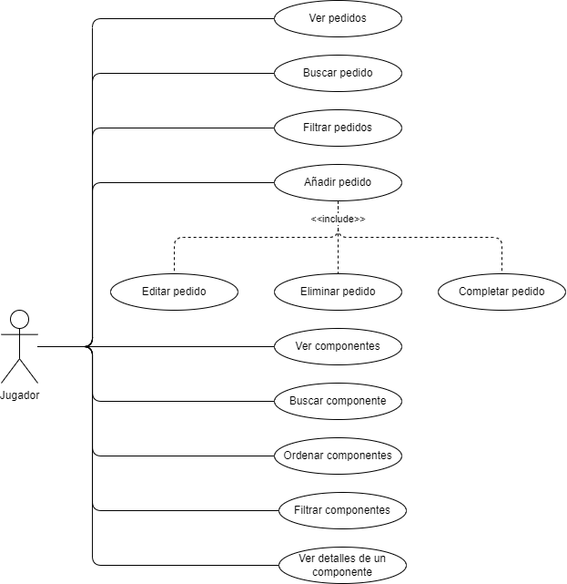

# Documentación de la app

- [Documentación de la app](#documentación-de-la-app)
  - [Descripción](#descripción)
  - [Casos de uso](#casos-de-uso)
    - [Relacionado con los pedidos](#relacionado-con-los-pedidos)
    - [Relacionado con los componentes](#relacionado-con-los-componentes)
    - [Descripción de casos de uso](#descripción-de-casos-de-uso)
      - [Añadir pedido](#añadir-pedido)
      - [Editar pedido](#editar-pedido)
      - [Eliminar pedido](#eliminar-pedido)
      - [Ver pedidos creados](#ver-pedidos-creados)
      - [Buscar pedidos](#buscar-pedidos)
      - [Marcar pedido como completado](#marcar-pedido-como-completado)
      - [Añadir componentes a un pedido](#añadir-componentes-a-un-pedido)
      - [Ordenar pedidos](#ordenar-pedidos)
      - [Ver componentes](#ver-componentes)
      - [Filtrar componentes](#filtrar-componentes)
      - [Buscar componentes](#buscar-componentes)
      - [Ver detalles de un componente](#ver-detalles-de-un-componente)
      - [Ordenar componentes](#ordenar-componentes)

## Descripción

Los clientes pueden solicitar un pedido, que puede ser de los siguientes tipos:

- **Montaje desde 0**: El jugador debe seleccionar **todos** los componentes que se van a utilizar en el montaje.
- **Reparación**: El jugador debe seleccionar los componentes a reparar.
- **Mejora**: El jugador debe mejorar el equipo para obtener una puntuación concreta en 3DMark.

Todos los pedidos pueden tener ciertos requisitos y datos a tener en cuenta:

<table border>
<caption align = "bottom"> </caption>
    <tr>
        <td>
            <th>Montaje desde 0</th>
            <th>Reparación</th>
            <th>Mejora</th>
        </td>
    </tr>
    <tr align = "center">
        <th>Nombre del cliente</th>
        <td>✅</td>
        <td>✅</td>
        <td>✅</td>
    </tr>
    <tr align = "center">
        <th>Presupuesto</th>
        <td>🔵</td>
        <td>🔵</td>
        <td>🔵</td>
    </tr>
    <tr align = "center">
        <th>Usar piezas nuevas</th>
        <td>🔵</td>
        <td>🔵</td>
        <td>🔵</td>
    </tr>
    <tr align = "center">
        <th>Marca favorita</th>
        <td>🔵</td>
        <td>🔵</td>
        <td>🔵</td>
    </tr>
    <tr align = "center">
        <th>Limpiar polvo</th>
        <td>❌</td>
        <td>🔵</td>
        <td>🔵</td>
    </tr>
    <tr align = "center">
        <th>Cambiar color de cables</th>
        <td>❌</td>
        <td>🔵</td>
        <td>🔵</td>
    </tr>
    <tr align = "center">
        <th>Ejecutar antivirus</th>
        <td>❌</td>
        <td>🔵</td>
        <td>🔵</td>
    </tr>
    <tr align = "center">
        <th>Instalar refrigeración líquida</th>
        <td>🔵</td>
        <td>🔵</td>
        <td>🔵</td>
    </tr>
    <tr align = "center">
        <th>Instalar doble GPU</th>
        <td>🔵</td>
        <td>🔵</td>
        <td>🔵</td>
    </tr>
    <tr align = "center">
        <th>Anotaciones</th>
        <td>🔵</td>
        <td>🔵</td>
        <td>🔵</td>
    </tr>
    <tr align = "center">
        <th>Puntuación objetivo 3DMark</th>
        <td>🔵</td>
        <td>🔵</td>
        <td>🔵</td>
    </tr>
    <tr align = "center">
        <th>Realizar overclocking</th>
        <td>🔵</td>
        <td>🔵</td>
        <td>🔵</td>
    </tr>
</table>

---

## Casos de uso

### Relacionado con los pedidos

- Añadir nuevos pedidos
- Editar pedidos
- Eliminar pedidos
- Ver todos los pedidos creados
- Buscar pedidos por el nombre del cliente
- Marcar pedidos como completados
- Seleccionar componentes
- Ordenar pedidos por:
  - Prioridad
  - Nombre
  - Fecha de creación

### Relacionado con los componentes

- Ver todos los componentes existentes
- Filtrar componentes
- Buscar componentes por nombre
- Ver detalles de los componentes
- Ordenar componentes por:
  - Nombre
  - Precio

> [!NOTE]
> Adicionalmente será posible añadir componentes a los pedidos teniendo en cuenta la compatibilidad entre componentes.

---

### Descripción de casos de uso

#### Añadir pedido

<table border>
    <tr align = "left">
        <th>Nombre</th>
        <td>Añadir pedido</td>
    </tr>
    <tr align = "left">
        <th>Descripción</th>
        <td>El jugador añade el pedido del cliente</td>
    </tr>
    <tr align = "left">
        <th>Pre-Condición</th>
        <td></td>
    </tr>
    <tr align = "left">
        <th>Post-Condición</th>
        <td>Se crea un pedido</td>
    </tr>
    <tr align = "left">
        <th>Situaciones de error</th>
        <td>No se introduce el nombre del cliente</td>
    </tr>
    <tr align = "left">
        <th>Actores</th>
        <td>Jugador</td>
    </tr>
    <tr align = "left">
        <th>Activación</th>
        <td>Un cliente necesita un servicio</td>
    </tr>
    <tr align = "left">
        <th>Flujo normal</th>
        <td>
            1. Jugador introduce los datos solicitados.
             2. Jugador añade los componentes necesarios.
             3. El sistema valida los datos introducidos.
             4. Jugador añade el pedido.
             5. El sistema muestra un mensaje informativo.
        </td>
    </tr>
    <tr align = "left">
        <th>Flujo alternativo</th>
        <td>
            3'. No se ha introducido ningún nombre de cliente.
             4'. El sistema informa al jugador.
             5'. Jugador introduce el nombre del cliente y añade el pedido.
        </td>
    </tr>
</table>

---

#### Editar pedido

<table border>
    <tr align = "left">
        <th>Nombre</th>
        <td>Editar pedido.</td>
    </tr>
    <tr align = "left">
        <th>Descripción</th>
        <td>El jugador edita el pedido seleccionado.</td>
    </tr>
    <tr align = "left">
        <th>Pre-Condición</th>
        <td>Jugador debe de haber añadido al menos un pedido.</td>
    </tr>
    <tr align = "left">
        <th>Post-Condición</th>
        <td>Se modifica un pedido</td>
    </tr>
    <tr align = "left">
        <th>Situaciones de error</th>
        <td>Se elimina el nombre del cliente</td>
    </tr>
    <tr align = "left">
        <th>Actores</th>
        <td>Jugador</td>
    </tr>
    <tr align = "left">
        <th>Activación</th>
        <td>Jugador necesita modificar un pedido</td>
    </tr>
    <tr align = "left">
        <th>Flujo normal</th>
        <td>
            1. Jugador selecciona el pedido a modificar.
             2. Jugador modifica los datos pertinentes.
             3. El sistema valida los datos introducidos.
             4. Jugador modifica el pedido.
             5. El sistema muestra un mensaje informativo.
        </td>
    </tr>
    <tr align = "left">
        <th>Flujo alternativo</th>
        <td>
            3'. Se ha eliminado el nombre del cliente.
             4'. El sistema informa al jugador.
             5'. Jugador introduce el nombre del cliente y completa la modificación.
        </td>
    </tr>
</table>

---

#### Eliminar pedido

<table border>
    <tr align = "left">
        <th>Nombre</th>
        <td>Eliminar pedido.</td>
    </tr>
    <tr align = "left">
        <th>Descripción</th>
        <td>El jugador elimina el pedido seleccionado.</td>
    </tr>
    <tr align = "left">
        <th>Pre-Condición</th>
        <td>Jugador debe de haber añadido al menos un pedido.</td>
    </tr>
    <tr align = "left">
        <th>Post-Condición</th>
        <td>Se elimina un pedido</td>
    </tr>
    <tr align = "left">
        <th>Situaciones de error</th>
        <td>Se elimina un pedido accidentalmente</td>
    </tr>
    <tr align = "left">
        <th>Actores</th>
        <td>Jugador</td>
    </tr>
    <tr align = "left">
        <th>Activación</th>
        <td>Jugador necesita eliminar un pedido</td>
    </tr>
    <tr align = "left">
        <th>Flujo normal</th>
        <td>
            1. Jugador selecciona el pedido a eliminar.
             2. El sistema pide una confirmación para eliminar el pedido.
             3. Jugador confirma la eliminación.
             4. El sistema muestra un mensaje informativo.
        </td>
    </tr>
    <tr align = "left">
        <th>Flujo alternativo</th>
        <td>
            3'. Jugador ha confirmado accidentalmente.
             4'. Jugador selecciona la opción 'Deshacer'.
             5'. El sistema restaura el pedido eliminado.
        </td>
    </tr>
</table>

---

#### Ver pedidos creados

<table border>
    <tr align = "left">
        <th>Nombre</th>
        <td>Ver pedidos creados.</td>
    </tr>
    <tr align = "left">
        <th>Descripción</th>
        <td>El jugador solicita ver los pedidos.</td>
    </tr>
    <tr align = "left">
        <th>Pre-Condición</th>
        <td></td>
    </tr>
    <tr align = "left">
        <th>Post-Condición</th>
        <td></td>
    </tr>
    <tr align = "left">
        <th>Situaciones de error</th>
        <td></td>
    </tr>
    <tr align = "left">
        <th>Actores</th>
        <td>Jugador</td>
    </tr>
    <tr align = "left">
        <th>Activación</th>
        <td>Jugador quiere ver los pedidos creados</td>
    </tr>
    <tr align = "left">
        <th>Flujo normal</th>
        <td>
            1. El sistema muestra una lista con todos los pedidos creados.
        </td>
    </tr>
    <tr align = "left">
        <th>Flujo alternativo</th>
        <td></td>
    </tr>
</table>

---

#### Buscar pedidos

<table border>
    <tr align = "left">
        <th>Nombre</th>
        <td>Buscar pedidos.</td>
    </tr>
    <tr align = "left">
        <th>Descripción</th>
        <td>El jugador busca pedidos por nombre.</td>
    </tr>
    <tr align = "left">
        <th>Pre-Condición</th>
        <td></td>
    </tr>
    <tr align = "left">
        <th>Post-Condición</th>
        <td></td>
    </tr>
    <tr align = "left">
        <th>Situaciones de error</th>
        <td>No se han encontrado pedidos</td>
    </tr>
    <tr align = "left">
        <th>Actores</th>
        <td>Jugador</td>
    </tr>
    <tr align = "left">
        <th>Activación</th>
        <td>Jugador quiere buscar un pedido</td>
    </tr>
    <tr align = "left">
        <th>Flujo normal</th>
        <td>
            1. Jugador introduce los términos de búsqueda.
             2. El sistema filtra los pedidos por nombre del cliente y muestra los resultados.
        </td>
    </tr>
    <tr align = "left">
        <th>Flujo alternativo</th>
        <td>
            2'. El sistema no encuentra pedidos con dicho nombre.
             3'. El sistema muestra un mensaje informando que no hay resultados.
        </td>
    </tr>
</table>

---

#### Marcar pedido como completado

<table border>
    <tr align = "left">
        <th>Nombre</th>
        <td>Marcar pedido como completado.</td>
    </tr>
    <tr align = "left">
        <th>Descripción</th>
        <td>El jugador marca un pedido como completado.</td>
    </tr>
    <tr align = "left">
        <th>Pre-Condición</th>
        <td>Debe de haber al menos un pedido</td>
    </tr>
    <tr align = "left">
        <th>Post-Condición</th>
        <td>Se completa un pedido</td>
    </tr>
    <tr align = "left">
        <th>Situaciones de error</th>
        <td></td>
    </tr>
    <tr align = "left">
        <th>Actores</th>
        <td>Jugador</td>
    </tr>
    <tr align = "left">
        <th>Activación</th>
        <td>Jugador quiere completar un pedido</td>
    </tr>
    <tr align = "left">
        <th>Flujo normal</th>
        <td>
            1. Jugador selecciona un pedido.
             2. Jugador lo marca como completado
             3. El sistema modifica la visualización y lo mueve de posición.
        </td>
    </tr>
    <tr align = "left">
        <th>Flujo alternativo</th>
        <td></td>
    </tr>
</table>

---

#### Añadir componentes a un pedido

<table border>
    <tr align = "left">
        <th>Nombre</th>
        <td>Añadir componentes a un pedido.</td>
    </tr>
    <tr align = "left">
        <th>Descripción</th>
        <td>El jugador marca un pedido como completado.</td>
    </tr>
    <tr align = "left">
        <th>Pre-Condición</th>
        <td>Debe de haber al menos un pedido</td>
    </tr>
    <tr align = "left">
        <th>Post-Condición</th>
        <td>Se añade un componente al pedido</td>
    </tr>
    <tr align = "left">
        <th>Situaciones de error</th>
        <td>El componente seleccionado no es compatible con el resto</td>
    </tr>
    <tr align = "left">
        <th>Actores</th>
        <td>Jugador</td>
    </tr>
    <tr align = "left">
        <th>Activación</th>
        <td>Jugador quiere añadir un componente al pedido</td>
    </tr>
    <tr align = "left">
        <th>Flujo normal</th>
        <td>
            1. Jugador selecciona un pedido.
             2. Jugador busca el componente que necesita
             3. Jugador añade el componente al pedido seleccionado.
             4. El sistema comprueba si se han añadido componentes al pedido.
             5. El sistema comprueba la compatibilidad de componentes.
             6. El sistema muestra un mensaje informativo.
        </td>
    </tr>
    <tr align = "left">
        <th>Flujo alternativo</th>
        <td>
            5'. El sistema detecta una incompatibilidad.
             6. El sistema muestra un mensaje informativo.
        </td>
    </tr>
</table>

---

#### Ordenar pedidos

<table border>
    <tr align = "left">
        <th>Nombre</th>
        <td>Ordenar pedidos.</td>
    </tr>
    <tr align = "left">
        <th>Descripción</th>
        <td>El jugador ordena la lista de componentes.</td>
    </tr>
    <tr align = "left">
        <th>Pre-Condición</th>
        <td></td>
    </tr>
    <tr align = "left">
        <th>Post-Condición</th>
        <td></td>
    </tr>
    <tr align = "left">
        <th>Situaciones de error</th>
        <td></td>
    </tr>
    <tr align = "left">
        <th>Actores</th>
        <td>Jugador</td>
    </tr>
    <tr align = "left">
        <th>Activación</th>
        <td>Jugador quiere ordenar la lista de componentes</td>
    </tr>
    <tr align = "left">
        <th>Flujo normal</th>
        <td>
            1. Jugador selecciona un el término de ordenación.
             2. El sistema ordena y muestra los resultados.
        </td>
    </tr>
    <tr align = "left">
        <th>Flujo alternativo</th>
        <td></td>
    </tr>
</table>

---

#### Ver componentes

<table border>
    <tr align = "left">
        <th>Nombre</th>
        <td>Ver componentes.</td>
    </tr>
    <tr align = "left">
        <th>Descripción</th>
        <td>El jugador quiere ver la lista de componentes existentes.</td>
    </tr>
    <tr align = "left">
        <th>Pre-Condición</th>
        <td></td>
    </tr>
    <tr align = "left">
        <th>Post-Condición</th>
        <td></td>
    </tr>
    <tr align = "left">
        <th>Situaciones de error</th>
        <td>No hay conexión / El servidor no está disponible</td>
    </tr>
    <tr align = "left">
        <th>Actores</th>
        <td>Jugador</td>
    </tr>
    <tr align = "left">
        <th>Activación</th>
        <td>Jugador quiere ver una lista de componentes</td>
    </tr>
    <tr align = "left">
        <th>Flujo normal</th>
        <td>
            1. El sistema muestra una lista de componentes.
        </td>
    </tr>
    <tr align = "left">
        <th>Flujo alternativo</th>
        <td>
            1'. El sistema muestra un mensaje de error.
        </td>
    </tr>
</table>

---

#### Filtrar componentes

<table border>
    <tr align = "left">
        <th>Nombre</th>
        <td>Filtrar componentes.</td>
    </tr>
    <tr align = "left">
        <th>Descripción</th>
        <td>El jugador quiere filtrar la lista de componentes.</td>
    </tr>
    <tr align = "left">
        <th>Pre-Condición</th>
        <td></td>
    </tr>
    <tr align = "left">
        <th>Post-Condición</th>
        <td></td>
    </tr>
    <tr align = "left">
        <th>Situaciones de error</th>
        <td>No se han encontrado resultados con el filtro.</td>
    </tr>
    <tr align = "left">
        <th>Actores</th>
        <td>Jugador</td>
    </tr>
    <tr align = "left">
        <th>Activación</th>
        <td>Jugador filtra la lista de componentes</td>
    </tr>
    <tr align = "left">
        <th>Flujo normal</th>
        <td>
            1. Jugador selecciona los filtros que quiere aplicar.
             2. El sistema muestra los resultados coincidentes
        </td>
    </tr>
    <tr align = "left">
        <th>Flujo alternativo</th>
        <td>
            2'. El sistema no encuentra ningún resultado.
             3'. El sistema informa al usuario.
        </td>
    </tr>
</table>

---

#### Buscar componentes

<table border>
    <tr align = "left">
        <th>Nombre</th>
        <td>Buscar componentes.</td>
    </tr>
    <tr align = "left">
        <th>Descripción</th>
        <td>El jugador quiere buscar un componente a través de su nombre.</td>
    </tr>
    <tr align = "left">
        <th>Pre-Condición</th>
        <td></td>
    </tr>
    <tr align = "left">
        <th>Post-Condición</th>
        <td></td>
    </tr>
    <tr align = "left">
        <th>Situaciones de error</th>
        <td>No hay resultados</td>
    </tr>
    <tr align = "left">
        <th>Actores</th>
        <td>Jugador</td>
    </tr>
    <tr align = "left">
        <th>Activación</th>
        <td>Jugador quiere buscar un componente</td>
    </tr>
    <tr align = "left">
        <th>Flujo normal</th>
        <td>
            1. Jugador introduce los términos de búsqueda.
             2. El sistema muestra los resultados coincidentes.
        </td>
    </tr>
    <tr align = "left">
        <th>Flujo alternativo</th>
        <td>
            2'. El sistema no encuentra ningún resultado.
             3. El sistema informa al usuario.
        </td>
    </tr>
</table>

---

#### Ver detalles de un componente

<table border>
    <tr align = "left">
        <th>Nombre</th>
        <td>Ver detalles de un componente.</td>
    </tr>
    <tr align = "left">
        <th>Descripción</th>
        <td>El jugador quiere ver los detalles técnicos de un componente.</td>
    </tr>
    <tr align = "left">
        <th>Pre-Condición</th>
        <td></td>
    </tr>
    <tr align = "left">
        <th>Post-Condición</th>
        <td></td>
    </tr>
    <tr align = "left">
        <th>Situaciones de error</th>
        <td></td>
    </tr>
    <tr align = "left">
        <th>Actores</th>
        <td>Jugador</td>
    </tr>
    <tr align = "left">
        <th>Activación</th>
        <td>Jugador quiere ver los detalles de un componente</td>
    </tr>
    <tr align = "left">
        <th>Flujo normal</th>
        <td>
            1. Jugador pulsa sobre un componente.
             2. El sistema muestra una ventana con los detalles del componente.
        </td>
    </tr>
    <tr align = "left">
        <th>Flujo alternativo</th>
        <td></td>
    </tr>
</table>

---

#### Ordenar componentes

<table border>
    <tr align = "left">
        <th>Nombre</th>
        <td>Ordenar componentes.</td>
    </tr>
    <tr align = "left">
        <th>Descripción</th>
        <td>El jugador quiere ordenar la lista de componentes.</td>
    </tr>
    <tr align = "left">
        <th>Pre-Condición</th>
        <td></td>
    </tr>
    <tr align = "left">
        <th>Post-Condición</th>
        <td></td>
    </tr>
    <tr align = "left">
        <th>Situaciones de error</th>
        <td></td>
    </tr>
    <tr align = "left">
        <th>Actores</th>
        <td>Jugador</td>
    </tr>
    <tr align = "left">
        <th>Activación</th>
        <td>Jugador quiere ordenar la lista de componentes</td>
    </tr>
    <tr align = "left">
        <th>Flujo normal</th>
        <td>
            1. Jugador selecciona el término de ordenación.
             2. El sistema muestra la lista ordenada.
        </td>
    </tr>
    <tr align = "left">
        <th>Flujo alternativo</th>
        <td></td>
    </tr>
</table>

---
